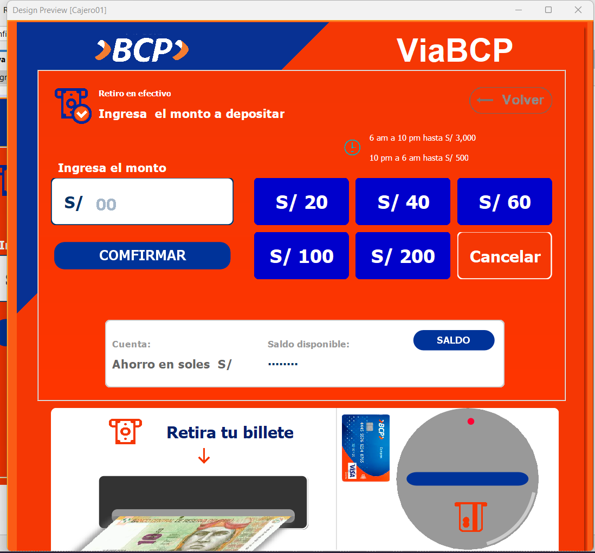
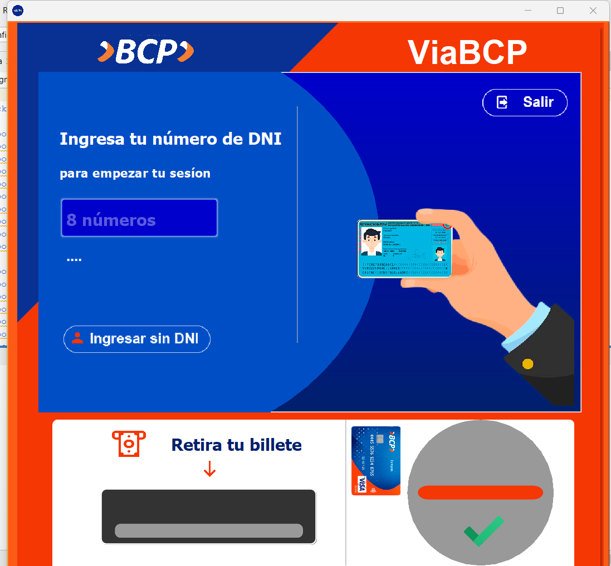
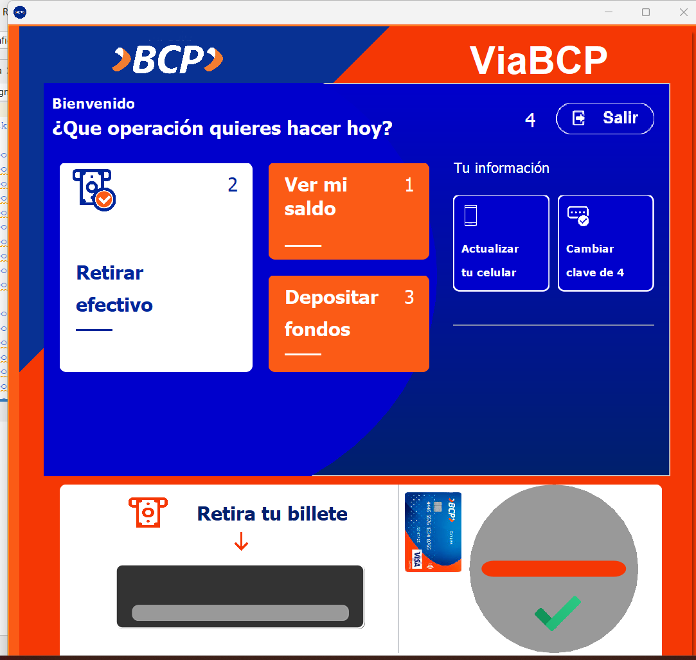

# Cajero BCP Simulador

Este proyecto es un **simulador de cajero automático** para el **Banco de Crédito del Perú (BCP)**, desarrollado en **Java con NetBeans**. Este simulador permite realizar operaciones comunes en un cajero automático como consultar saldo, retirar dinero, y realizar transferencias, todo simulado para fines educativos.

## 🖼️ Capturas

A continuación, se muestran algunas capturas del sistema en acción:

1. **Pantalla de inicio de sesión**  
   

2. **Interfaz de consulta de saldo**  
   

3. **Pantalla de retiro de dinero**  
   

4. **Interfaz de transferencia de fondos**  
   

## 🚀 Requisitos

- **JDK (Java Development Kit)** 8 o superior.
- **NetBeans IDE** para ejecutar el proyecto.
